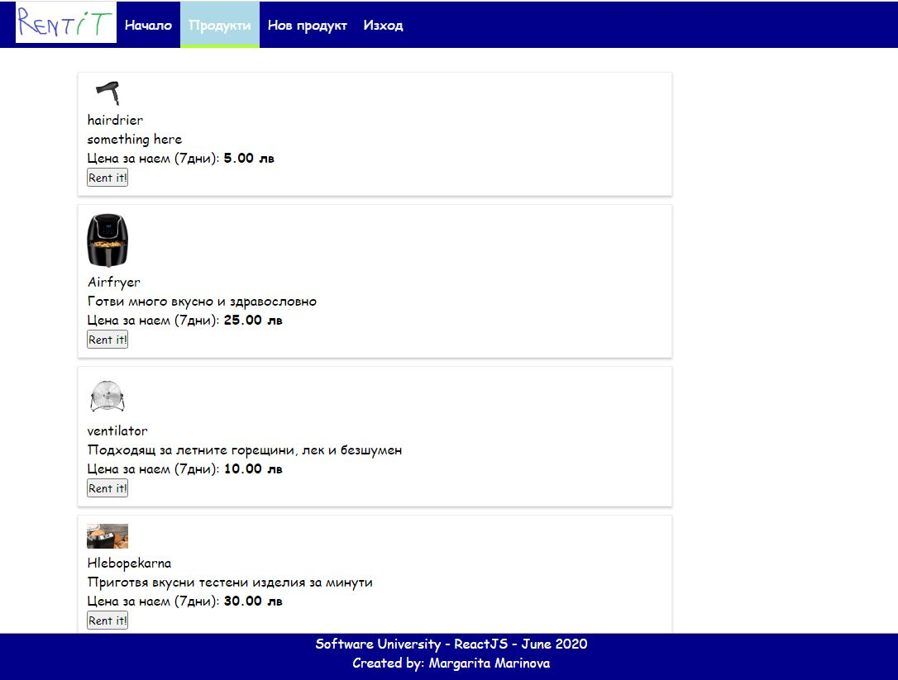

# RentIt app

(Exam project) RentIt is an app that give users the opportunity to rent different items or to upload their own for rent.

## Install

/Execute from project root directory/

Install project dependencies:
```
npm install
```
Start the app:
```
npm start
```

Open in browser:
```
https://localhost:3000
```
## Basic dependencies
* Use Firebase as a database and REST api services
* Use React for front-end
